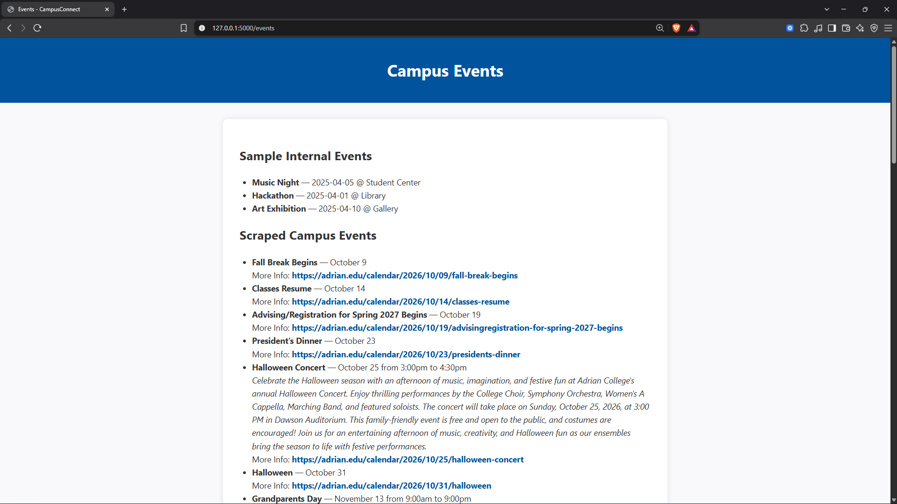
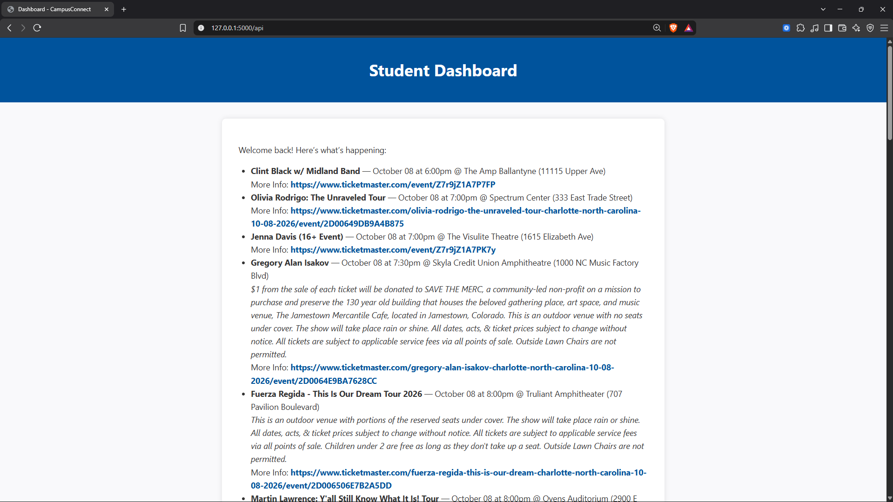

# CampusConnect Local API Display
A locally hosted web application that displays information from two APIs; a college event calendar and nearby events from the Ticketmaster API. Built to practice working with APIs as a final project for one of my programming courses.

## Technologies
- HTML5
- Pyhton
- Ticketmaster API

## Setup
1. Clone this repository
2. Get a free API key from [Ticketmaster](https://developer.ticketmaster.com/products-and-docs/apis/getting-started/)
3. Install the necessary packages with the command
```bash
pip install flask requests beautifulsoup4 selenium
```
4. Setup your database using the pre-written schema with the command
```bash
sqlite3 db/campusconnect.db < db/schema.sql
```
5. Seed your database with starter data with the command
```bash
python db/seed_data.py
```
6. Start the program with the command
```bash
python app.py
```
7. Open api_client.py, find self.api_key, and replace the placeholder value with your Ticketmaster API key
8. Run app.py
9. Open localhost http://127.0.0.1:5000/

## Preview




## What I Learned
- Working with external APIs
- Working with SQLite databases
- Working with HTML
